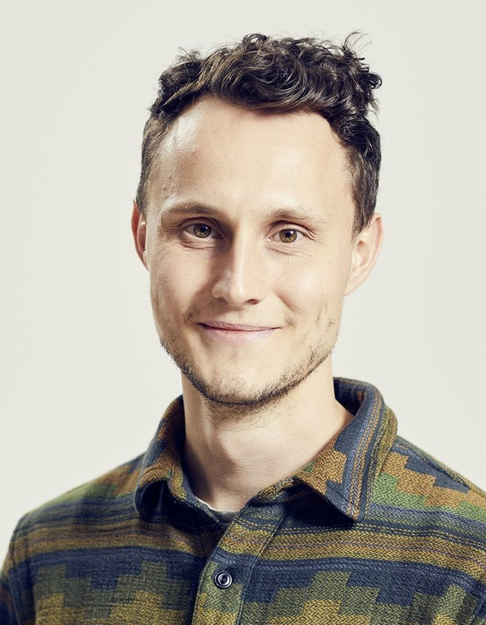

 
 

 
 

  As a PhD student in cognitive neuroscience, I am interested in how the human brain manages to represent the complex, volatile, and highdimensional world we find ourselves in. Recent advances in the field have provided exciting tools to map the structure of the perceived world to patterns of brain activity. This has put scientific models of mental representation within reach, yet our knowledge is still expanding and shifting constantly. I am currently a student within the newly founded [Max Planck School of Cognition](https://www.maxplanckschools.de/en/cognition). Here, I am preparing for a long-lasting career to keep adding to these questions. Another focus of mine lies in using and contributing to [frameworks that promote reproducibility, transparency, and general best practice in the analysis of neuroimaging data](http://centerforopenneuroscience.org/) (specifically fMRI). Beyond all things neuroscience, I love computers, books, jazz guitar, and <a target="_blank" HREF="images/klaus.jpg">my friendly dinosaur</a>.

 

  
  
  
  

